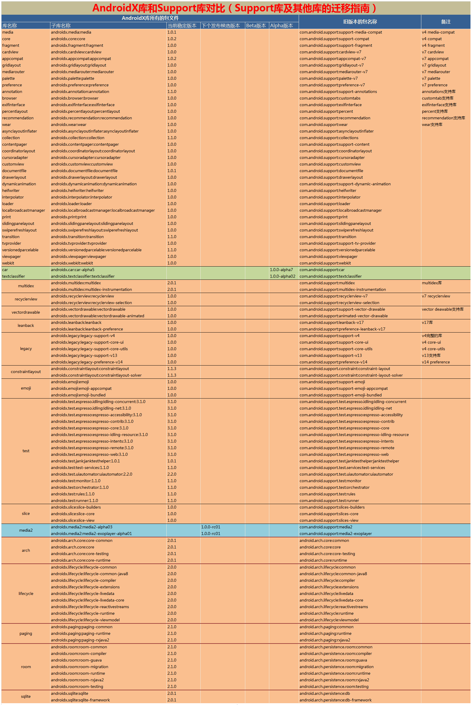
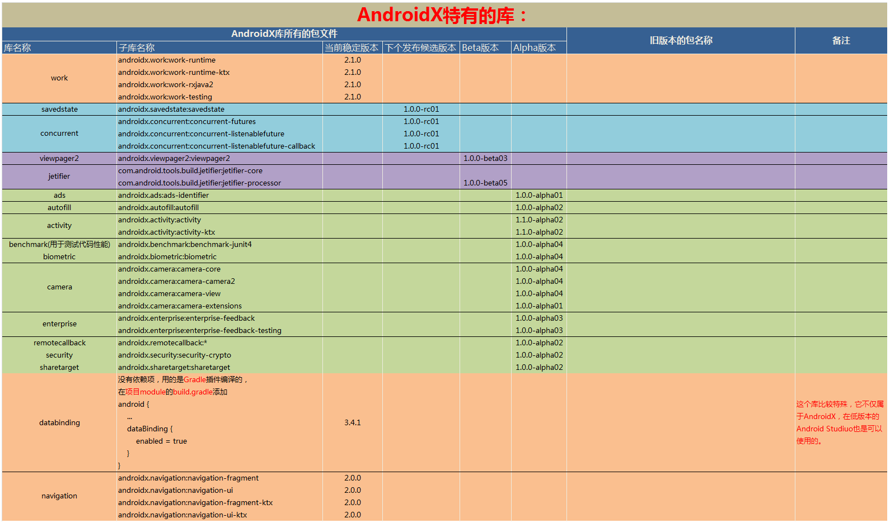

## Android Studio版本、Gradle版本、Build Tools版本对照详细解答

### 一、Android Studio版本、Gradle版本、Build Tools版本图解

**官网的原版图是这样的：（原网址：[https://developer.android.google.cn/studio/releases/gradle-plugin](https://developer.android.google.cn/studio/releases/gradle-plugin)）**

| Plugin版本( Android Studio 版本) | Gradle 版本|
|----|----|
| 3.5.0| 5.4.1+|
| 3.4.0-3.4.1|5.1.1+|
| 3.3.0 - 3.3.2| 4.10.1+|
| 3.2.0 - 3.2.1| 4.6+|
| 3.1.0+| 4.4+|
| 3.0.0+| 4.1+|
| 2.3.0+| 3.3+|
| 2.1.3 - 2.2.3| 2.14.1+|
| 2.0.0 - 2.1.2| 2.10 - 2.13|
| 1.5.0| 2.2.1 - 2.13 |
| 1.2.0 - 1.3.1| 2.2.1 - 2.9|
| 1.0.0 - 1.1.3| 2.2.1 - 2.3|

> **下图是我根据谷歌的官网找到的资料整理的一张表，这张图可以很直观的看到Android Studio版本、Gradle版本、Build Tools版本三者之间的相互匹配关系，大家可以对照着这个图查看，这张图可以解决大家关于版本匹配遇到的难题。**


| Plugin版本( Android Studio 版本) | Gradle 版本 | 对应的 Build Tools 版本 | 对应的 CMake 版本 |
|----|----|----|----|
| Android Studio 3.5.0+|Gradle 5.4.1+| Build Tools 28.0.3+||
| Android Studio 3.4.1 |Gradle 5.1.1+| Build Tools 28.0.3+||
| Android Studio 3.4.0 |Gradle 5.1.1+| Build Tools 28.0.3+||
| Android Studio 3.3.2 |Gradle 4.10.1+ |Build Tools 28.0.3+||
| Android Studio 3.3.1 |Gradle 4.10.1+ |Build Tools 28.0.3+||
| Android Studio 3.3.0 |Gradle 4.10.1+ |Build Tools 28.0.3+||
| Android Studio 3.2.1 |Gradle 4.6+ | Build Tools 28.0.3+||
| Android Studio 3.2.0 |Gradle 4.6+ | Build Tools 28.0.3+||
| Android Studio 3.1.4 |Gradle 4.4+ | Build Tools 27.0.3+ |官网没说 |
| Android Studio 3.1.3 |Gradle 4.4+ | Build Tools 27.0.3+ |官网没说 |
| Android Studio 3.1.2 |Gradle 4.4+ | Build Tools 27.0.3+ |官网没说 |
| Android Studio 3.1.1 |Gradle 4.4+ | Build Tools 27.0.3+ |官网没说 |
| Android Studio 3.1.0 |Gradle 4.4+ | Build Tools 27.0.3+ |官网没说 |
| Android Studio 3.0.1 |Gradle 4.1+ | Build Tools 26.0.2+ |CMake 3.7+ |
| Android Studio 3.0.0 |Gradle 4.1+ | Build Tools 26.0.2+ |CMake 3.7+ |
| Android Studio 2.3.3 |Gradle 3.3+ | Build Tools 25.0.0+||
| Android Studio 2.3.2 |Gradle 3.3+ | Build Tools 25.0.0+||
| Android Studio 2.3.1 |Gradle 3.3+ | Build Tools 25.0.0+||
| Android Studio 2.3.0 |Gradle 3.3+ | Build Tools 25.0.0+||
| Android Studio 2.2.3 |Gradle 2.14.1+ |Build Tools 23.0.2+||
| Android Studio 2.2.2 |Gradle 2.14.1+ |Build Tools 23.0.2+||
| Android Studio 2.2.1 |Gradle 2.14.1+ |Build Tools 23.0.2+||
| Android Studio 2.2.0 |Gradle 2.14.1+ |Build Tools 23.0.2+||
| Android Studio 2.1.3 |Gradle 2.14.1+ |Build Tools 23.0.2+||
| Android Studio 2.1.2 |Gradle 2.10 - 2.13|Build Tools 23.0.2+||
| Android Studio 2.1.1 |Gradle 2.10 - 2.13|Build Tools 23.0.2+||
| Android Studio 2.1.0 |Gradle 2.10 - 2.13| Build Tools 23.0.2+||
| Android Studio 2.0.0 |Gradle 2.10 - 2.13| Build Tools 21.1.1+||
| Android Studio 1.5.0 |Gradle 2.2.1 - 2.13| Build Tools 21.1.1+||
| Android Studio 1.3.1 |Gradle 2.2.1 - 2.9| Build Tools 21.1.1+||
| Android Studio 1.3.0 |Gradle 2.2.1 - 2.9| Build Tools 21.1.1+||
| Android Studio 1.2.0 |Gradle 2.2.1 - 2.9| Build Tools 21.1.1+||
| Android Studio 1.1.3 |Gradle 2.2.1 - 2.3| Build Tools 21.1.1+||
| Android Studio 1.1.2 |Gradle 2.2.1 - 2.3| Build Tools 21.1.1+||
| Android Studio 1.1.1 |Gradle 2.2.1 - 2.3| Build Tools 21.1.1+||
| Android Studio 1.1.0 |Gradle 2.2.1 - 2.3| Build Tools 21.1.1+||
| Android Studio 1.0.1 |Gradle 2.2.1-2.3.x | Build Tools 21.1.1+||
| Android Studio 1.0.0 |Gradle 2.2.1-2.3.x | Build Tools 21.1.1+||

Android Studio 3.5.0 (2019年8月)
​	Android Studio 3.4.2 (2019年7月)
​	Android Studio 3.4.1 (2019年5月)
​	Android Studio 3.4.0 (2019年4月)
​	Android Studio 3.3.2 (2019年3月)
​	Android Studio 3.3.1 (2019年2月)
​	Android Studio 3.3.0 (2019年1月)
​	Android Studio 3.2.1 (2018年10月)
​	Android Studio 3.2.0 (2018年9月)
​	Android Studio 3.1.4 (2018年8月)
​	Android Studio 3.1.3 (2018年6月)
​	Android Studio 3.1.2（2018年4月）
​	Android Studio 3.1.1（2018年4月）
​	Android Studio 3.1.0 (2018年3月)
​	Android Studio 3.0.1（2017年11月）
​	Android Studio 3.0.0 (2017年10月)
​	Android Studio 2.3.3（2017年6月）
​	Android Studio 2.3.2（2017年5月）
​	Android Studio 2.3.1（2017年4月）
​	Android Studio 2.3.0 (2017年3月)
​	Android Studio 2.2.3（2016年12月）
​	Android Studio 2.2.2（2016年10月）
​	Android Studio 2.2.1（2016年10月）
​	Android Studio 2.2.0 (2016年9月)
​	Android Studio 2.1.3（2016年8月）
​	Android Studio 2.1.2（2016年6月）
​	Android Studio 2.1.1（2016年5月）
​	Android Studio 2.1.0 (2016年4月)
​	Android Studio 2.0.0 (2016年4月)

----

### 二、NDK开发 ----  CMake的版本号

> **更多关于CMake的介绍可以查看：**
[https://developer.android.google.cn/studio/projects/add-native-code.html#vanilla_cmake](
https://developer.android.google.cn/studio/projects/add-native-code.html#vanilla_cmake)

----

### 三、Android Studio版本历史：

> **更多关于Android Studio介绍可以查看：**
> [https://developer.android.google.cn/studio/releases/](https://developer.android.google.cn/studio/releases/)

```
	Android Studio 3.5.0 (2019年8月)
	Android Studio 3.4.2 (2019年7月)
	Android Studio 3.4.1 (2019年5月)
	Android Studio 3.4.0 (2019年4月)
	Android Studio 3.3.2 (2019年3月)
	Android Studio 3.3.1 (2019年2月)
	Android Studio 3.2.1 (2018年10月)
	Android Studio 3.2.0 (2018年9月)
	Android Studio 3.1.4 (2018年8月)
	Android Studio 3.1.3 (2018年6月)
	Android Studio 3.1.2（2018年4月）
	Android Studio 3.1.1（2018年4月）
	Android Studio 3.1.0 (2018年3月)
	Android Studio 3.0.1（2017年11月）
	Android Studio 3.0.0 (2017年10月)
	Android Studio 2.3.3（2017年6月）
	Android Studio 2.3.2（2017年5月）
	Android Studio 2.3.1（2017年4月）
	Android Studio 2.3.0 (2017年3月)
	Android Studio 2.2.3（2016年12月）
	Android Studio 2.2.2（2016年10月）
	Android Studio 2.2.1（2016年10月）
	Android Studio 2.2.0 (2016年9月)
	Android Studio 2.1.3（2016年8月）
	Android Studio 2.1.2（2016年6月）
	Android Studio 2.1.1（2016年5月）
	Android Studio 2.1.0 (2016年4月)
	Android Studio 2.0.0 (2016年4月)
```

----

### 四、Build Tools 版本号历史：

> **每个版本的详细描述可以查看：**
> [https://developer.android.google.cn/studio/releases/build-tools](https://developer.android.google.cn/studio/releases/build-tools)

```
	Build Tools 29.0.2 （2019年8月）
	Build Tools 29.0.0 （2019年6月）
	Build Tools 28.0.3 （2018年9月）
	Build Tools 28.0.2 （2018年8月）
	Build Tools 27.0.3 （2017年12月）
	Build Tools 27.0.2 （2017年12月）
	Build Tools 27.0.1 （2017年11月）
	Build Tools 26.0.2 （2017年10月）
	Build Tools 26.0.1 （2017年7月）
	Build Tools 26.0.0 （2017年6月）
	Build Tools 25.0.3 （2017年4月）
	Build Tools 25.0.2 （2016年12月）
	Build Tools 25.0.1 （2016年11月）
	Build Tools 25.0.0 （2016年10月）
	Build Tools 24.0.3 （2016年9月）
	Build Tools 23.0.3 （2016年3月）
	Build Tools 23.0.2 （2015年11月）
	Build Tools 23.0.1 （2015年10月）
	Build Tools 23.0.0 （2015年8月）
	Build Tools 22.0.1 （2015年3月）
	Build Tools 22.0.0 （2015年3月）
	Build Tools 21.1.2 （2015年2月）
	Build Tools 21.1.1 （2014年11月）
	Build Tools 21.1 （2014年10月）
	Build Tools 21.0.2 （2014年10月）
	Build Tools 21.0.1 （2014年10月）
	Build Tools 21.0.0 （2014年10月）
	Build Tools 20.0.0 （2014年6月）
	Build Tools 19.1.0 （2014年5月）
	Build Tools 19.0.3 （2014年3月）
	Build Tools 19.0.2 （2014年2月）
	Build Tools 19.0.1 （2013年12月）
	Build Tools 19 （2013年10月）
	Build Tools 18.1.1 （2013年9月）
	Build Tools 18.1.0 （2013年9月）
	Build Tools 18.0.1 （2013年7月）
	Build Tools 17 （2013年5月）
```

----

### 五、Kotlin的Gradle插件的版本号

> **更多关于kotin Gradle插件介绍可以查看：**
> [https://plugins.gradle.org/plugin/org.jetbrains.kotlin.android](https://plugins.gradle.org/plugin/org.jetbrains.kotlin.android)

在项目的根路径的`build.gradle`里面，有这样的引用：

```groovy
buildscript {
    
    ext.kotlin_version = '1.3.50'
    
    repositories {
        google()
        jcenter()
    }
    
    dependencies {
        classpath 'com.android.tools.build:gradle:3.5'
	
	    // 使用 kotlin的Gradle插件
        classpath "org.jetbrains.kotlin:kotlin-gradle-plugin:$kotlin_version"

        // NOTE: Do not place your application dependencies here; they belong
        // in the individual module build.gradle files
    }
}

```

其中`ext.kotlin_version = '1.3.50'`，这里面的`1.3.50`就是kotlin Gradle的插件的版本号。如果不知道版本号，可以在下表中查找：

```
	1.3.50
	1.3.41
	1.3.40
	1.3.31
	1.3.30
	1.3.21
	1.3.20
	1.3.11
	1.3.10
	1.3.0
	1.3.0-rc-198
	1.3.0-rc-190
	1.2.71
	1.2.70
	1.2.61
	1.2.60
	1.2.51
	1.2.50
	1.2.41
	1.2.40
	1.2.31
	1.2.30
	1.2.21
	1.2.20
	1.2.10
	1.2.0
	1.1.61
	1.1.60
	1.1.51
	1.1.50
	1.1.4-3
	1.1.4-2
	1.1.4
	1.1.3-2
	1.1.3
	1.1.2-5
	1.1.2-2
	1.1.2
	1.1.1
```

----

### 六、Kotlin.android.extensions 的Gradle插件的版本号

> **更多关于kotin Gradle插件介绍可以查看：**
> [https://plugins.gradle.org/plugin/org.jetbrains.kotlin.android.extensions](https://plugins.gradle.org/plugin/org.jetbrains.kotlin.android.extensions)

在项目的根路径的`build.gradle`里面，有这样的引用：

```groovy
buildscript {
    
    ext.kotlin_version = '1.3.50'
    
    repositories {
        google()
        jcenter()
    }
    
    dependencies {
        classpath 'com.android.tools.build:gradle:3.5'
	
	    // 使用 kotlin的Gradle插件
        classpath "org.jetbrains.kotlin:kotlin-gradle-plugin:$kotlin_version"

        // NOTE: Do not place your application dependencies here; they belong
        // in the individual module build.gradle files
    }
}

apply plugin: "org.jetbrains.kotlin.android.extensions"

```

其中`ext.kotlin_version = '1.3.50'`，这里面的`1.3.50`就是kotlin Gradle的插件的版本号。如果不知道版本号，可以在下表中查找：

```
	1.3.50
	1.3.41
	1.3.40
	1.3.31
	1.3.30
	1.3.21
	1.3.20
	1.3.11
	1.3.10
	1.3.0
	1.3.0-rc-198
	1.3.0-rc-190
	1.2.71
	1.2.70
	1.2.61
	1.2.60
	1.2.51
	1.2.50
	1.2.41
	1.2.40
	1.2.31
	1.2.30
	1.2.21
	1.2.20
	1.2.10
	1.2.0
	1.1.61
	1.1.60
	1.1.51
	1.1.50
	1.1.4-3
	1.1.4-2
	1.1.4
	1.1.3-2
	1.1.3
	1.1.2-5
	1.1.2-2
	1.1.2
	1.1.1
```

----

### 七、Kotlin-stdlib的版本号

> **更多关于kotin Gradle插件介绍可以查看：**
> [https://mvnrepository.com/artifact/org.jetbrains.kotlin](https://mvnrepository.com/artifact/org.jetbrains.kotlin)


在项目module里的`build.gradle`里面，有这样的引用：

```
dependencies {
    // 直接引用kotlin_version变量，便于版本更改
    implementation"org.jetbrains.kotlin:kotlin-stdlib-jdk8:$kotlin_version"
    // 如果要使用jre8或者jre7，建议直接写对应版本号
    // implementation"org.jetbrains.kotlin:kotlin-stdlib-jdk8:1.3.50"
}

```

其中`org.jetbrains.kotlin:kotlin-stdlib-jdk8:1.3.50`，这里面的  `1.3.50`  就是 `kotlin-stdlib-jdk8` 的版本号。如果不知道版本号，可以在下表中查找：

**[总结：] `kotlin-stdlib-jdk8` 和 `kotlin-stdlib-jdk7` 适用的版本号必须大于等于1.2.0;  `kotlin-stdlib-jre8` 和 `kotlin-stdlib-jre7` 适用的版本号必须小于等于1.2.71，现在的开发中基本都用`kotlin-stdlib-jdk8` 和 `kotlin-stdlib-jdk7`  这两个。**

| 版本号| org.jetbrains.kotlin:kotlin-stdlib-jdk8 | org.jetbrains.kotlin:kotlin-stdlib-jdk7 | org.jetbrains.kotlin:kotlin-stdlib-jre8 | org.jetbrains.kotlin:kotlin-stdlib-jre7 |
|----|----|----|----|----|
| 1.3.50|√|√|×|×|
| 1.3.41|√|√|×|×|
| 1.3.40|√|√|×|×|
| 1.3.31|√|√|×|×|
| 1.3.30|√|√|×|×|
| 1.3.21|√|√|×|×|
| 1.3.20|√|√|×|×|
| 1.3.11|√|√|×|×|
| 1.3.10|√|√|×|×|
| 1.3.0 |√|√|×|×|
| 1.3.0-rc-198 |√|√|×|×|
| 1.3.0-rc-190 |√|√|×|×|
| 1.2.71|√|√|√|√|
| 1.2.70|√|√|√|√|
| 1.2.61|√|√|√|√|
| 1.2.60|√|√|√|√|
| 1.2.51|√|√|√|√|
| 1.2.50|√|√|√|√|
| 1.2.41|√|√|√|√|
| 1.2.40|√|√|√|√|
| 1.2.31|√|√|√|√|
| 1.2.30|√|√|√|√|
| 1.2.21|√|√|√|√|
| 1.2.20|√|√|√|√|
| 1.2.10|√|√|√|√|
| 1.2.0 |√|√|√|√|
| 1.1.61| ×|×|√|√|
| 1.1.60| ×|×|√|√|
| 1.1.51| ×|×|√|√|
| 1.1.50| ×|×|√|√|
| 1.1.4-3| ×|×|√|√|
| 1.1.4-2| ×|×|√|√|
| 1.1.4 | ×|×|√|√|
| 1.1.3-2| ×|×|√|√|
| 1.1.3 | ×|×|√|√|
| 1.1.2-5| ×|×|√|√|
| 1.1.2-4| ×|×|√|√|
| 1.1.2-3| ×|×|√|√|
| 1.1.2-2| ×|×|√|√|
| 1.1.2 | ×|×|√|√|
| 1.1.1 | ×|×|√|√|
| 1.1.0 | ×|×|√|√|

----

### 八、关于support包的版本（这个经常容易报错的）：

> **26以后的详情可以参考（>=26）：**
> [https://developer.android.google.cn/topic/libraries/support-library/revisions](https://developer.android.google.cn/topic/libraries/support-library/revisions)
>
> **26以前的详情可以参考（<=26）：**
> [https://developer.android.google.cn/topic/libraries/support-library/rev-archive](https://developer.android.google.cn/topic/libraries/support-library/rev-archive)


**注：`28.0.0` 是support库的最后一次版本的更新，官方不再支持更新，如需使用最新版本，可以使用 `AndroidX` 替代，后文有 `AndroidX` 详细介绍。**


```
	28.0.0（2018年8月）
	27.1.1（2018年4月）
	27.1.0（2018年2月）
	27.0.2（2017年11月）
	27.0.1（2017年11月）
	27.0.0（2017年10月）
	26.1.0（2017年9月）
	26.0.2（2017年8月）
	26.0.1（2017年8月）
	26.0.0（2017年7月）
	26.0.0 Beta 2（2017年6月）
	26.0.0 Beta 1（2017年5月）
	26.0.0 Alpha 1（2017年3月）
	25.4.0（2017年6月）
	25.3.1（2017年3月）
	25.3.0（2017年3月）
	25.2.0（2017年2月）
	25.1.1（2017年1月）
	25.1.0（2016年12月）
	25.0.1
	25.0.0
	24.2.1
	24.2.0
	24.1.1
	24.1.0
	24.0.0
	23.4.0
	23.3.0
	23.2.1
	23.2.0
	23.1.1
	23.1.0
	23.0.1
	23
	22.2.1
	22.2.0
	22.1.0
	22
	21.0.3
	21.0.2
	21.0.1
	21
	20
	19.1.0
	19.0.1
	19
```

-----

### 七、AndroidX介绍和迁移指南（support包在28.0.0版本之后使用AndroidX）

这里内容有限，不方便展示太多，具体的每一个细节的内容介绍，可以看我的博客，有详细讲解：**[AndroidX库和一般库的详细对比以及迁移中遇到的坑总结](https://www.jianshu.com/p/391d8547ab8b)**

###### 但是官方的那几个链接看起来还不是很舒服，想找的东西不好找，有时候你想用一个库接找半天才找到，所以我就把AndroidX和普通的依赖库做成了一张对比表，方便大家查阅和使用。如下图所示（图片很大，需要双击放大才可以看得更清楚，或者直接看原图）：


> **AndroidX与Support库及其他库的对比：**



> **AndroidX特有的库：**




> **不属于AndroidX的库（Design库，没想到基本上常用的Support库都放到AndroidX中了，只有Design库没有放进去，不知道为啥？而且依赖库的包名都不一样？）：**


官方有好几个文件提出了如何迁移到AndroidX库，具体如下：

* **AndroidX概览：** [https://developer.android.google.cn/jetpack/androidx](https://developer.android.google.cn/jetpack/androidx)

* **AndroidX和旧的依赖库对照表：** [https://developer.android.google.cn/jetpack/androidx/migrate](https://developer.android.google.cn/jetpack/androidx/migrate)

* **AndroidX各个库的版本号：**  [https://developer.android.google.cn/jetpack/androidx/versions](https://developer.android.google.cn/jetpack/androidx/versions)
